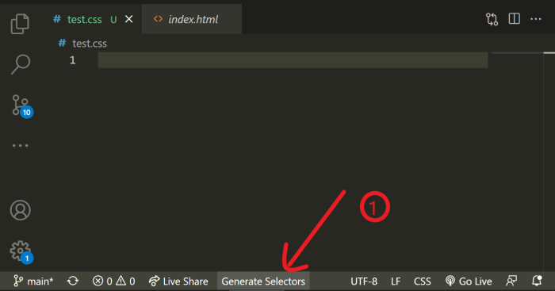
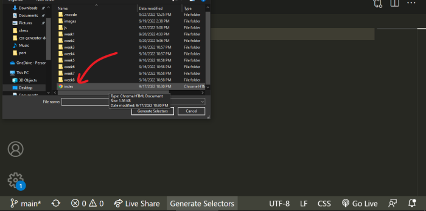
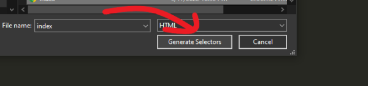

# CSS Selector Generator

CSS Selector generator generates CSS selectors for all classes and ids in any HTML file. CSS Selector generator also includes CSS resets to save you time on that too!

## Features

Easily accessible 'Generate CSS' button once activated. If you have written some CSS already, CSS Selector generator would only generate selectors for classes and ids not present in the current file. If the extension does not initialize at start-up, activate CSS Selector using the command palette.  

  
  
  

## Support

Support my bugs... I mean, debugging! ☕: [Buy me a coffee](https://buymeacoffee.com/kelvin.ajibola)  

Email: [kelajibola@gmail.com](mailto:kelajibola@gmail.com) for suggestions, bugs, or complaints while using the extension. Also, thank you so much for considering using CSS Selector Generator. You make everything worth it!  

## Known Issues

CSS Selector generator might select text content if they contain `"id= "`, `"class= "`, `"id ="`, or `"class ="`.  

## Release Notes

### 0.0.1

Initial release of CSS Selector generator  

### 0.0.2

Generate Selector Tab runs at startup. Only visible when a CSS file is open.  

## 1.1.0

- CSS reset replaced by a more reasonable version.  
- Documents now need to be saved to avoid version conflicts.  
- Minor bug fixes.  

## 1.1.1

- Selectors can be generated for `.ejs`, `.jsp`, and `.php` files as well.  

**Olamilekan Ajibola**
