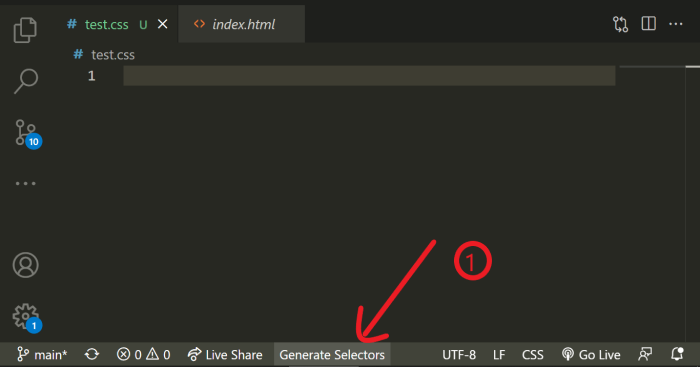
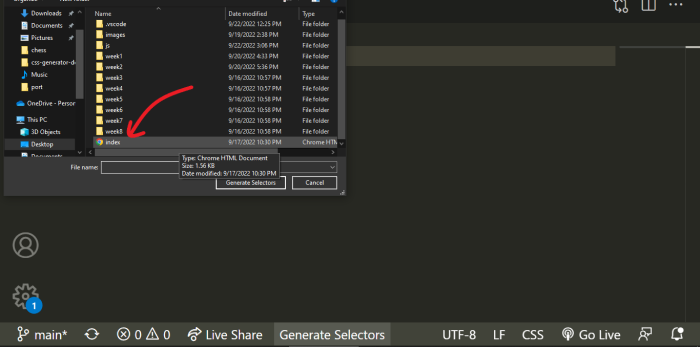
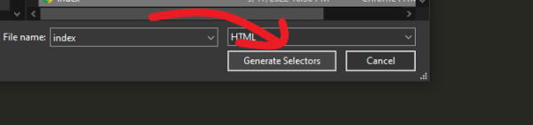

# CSS Selector Generator [CSG]

CSS Selector Generator is an extremely powerful extension that automates the tedious process of writing CSS by dynamically generating selectors for all classes and IDs from your markup files. It intelligently parses your HTML, components, or templates, and intelligently appends missing selectors to your stylesheet!

## Features

- **One-Click Generation**: An easily accessible 'Generate Selectors' button appears in your Status Bar whenever a stylesheet is open.
- **Smart Diffing**: CSG strictly analyzes your active stylesheet and *only* presents classes and IDs that are not already defined.
- **Interactive QuickPick Menu**: You are presented with a beautiful multi-select list of missing selectors. Pick exactly what you want to generate.
- **Modern Framework Support**: Fully supports React (JSX/TSX), Vue, Svelte, PHP, EJS, and JSP files. It perfectly parses `className`, `:class`, and Svelte directives.
- **Preprocessor Support**: Activates seamlessly on `.css`, `.scss`, `.less`, and `.sass` files!
- **Customizable**: Allows you to insert selectors right at your active cursor and configure global resets.

  
  
  

## Configuration Settings

You can customize the extension via your VS Code Settings:
- `css-selector-generator.includeReset` (default: `true`): Injects a global CSS reset (`* { margin: 0; border: 0; }`) at the top of fresh files.
- `css-selector-generator.insertAtCursor` (default: `false`): If enabled, generated selectors are dropped at your current cursor position instead of appending to the bottom of the file.

## Support

Support my bugs... I mean, debugging! ☕: [Buy me a coffee](https://buymeacoffee.com/kelvin.ajibola)  

Email: [kelajibola@gmail.com](mailto:kelajibola@gmail.com) for suggestions, bugs, or complaints while using the extension. Also, thank you so much for considering using CSS Selector Generator. You make everything worth it!  

## Release Notes

### 2.0.0 (Massive Upgrade)
- **New**: Interactive multi-select QuickPick menu to choose exact selectors!
- **New**: Full support for React/JSX, Vue, Svelte, SCSS, LESS, and SASS.
- **New**: Settings added for `insertAtCursor` and `includeReset`.
- **Fixed**: Robust token-based parsing perfectly strips HTML/JS comments and avoids false-positive text matches!
- **Performance**: Extension rewritten in strict TypeScript and bundled with Esbuild for lightning-fast speeds.

### 1.1.2
- Selectors can be generated for `.ejs`, `.jsp`, and `.php` files as well.

### 1.1.0
- CSS reset replaced by a more reasonable version.  
- Documents now need to be saved to avoid version conflicts.  

**Olamilekan Ajibola**
